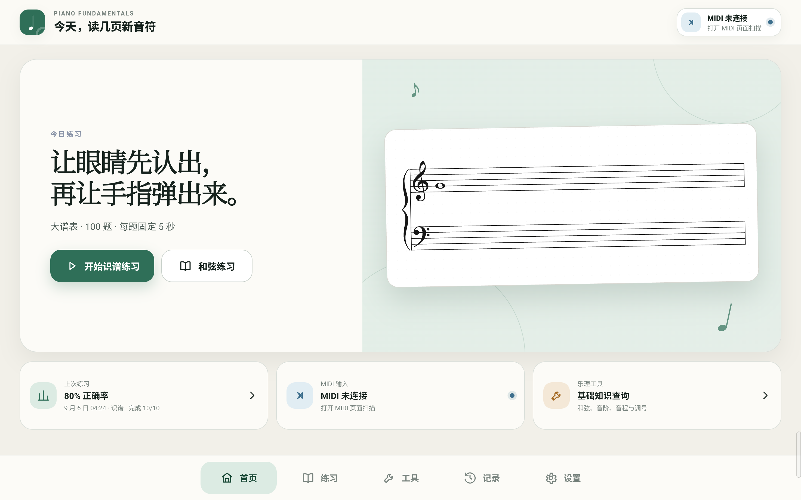
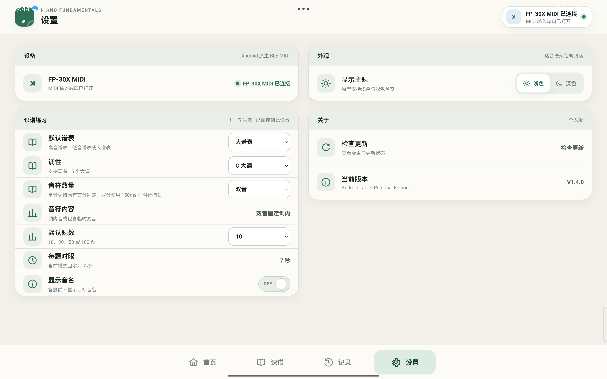
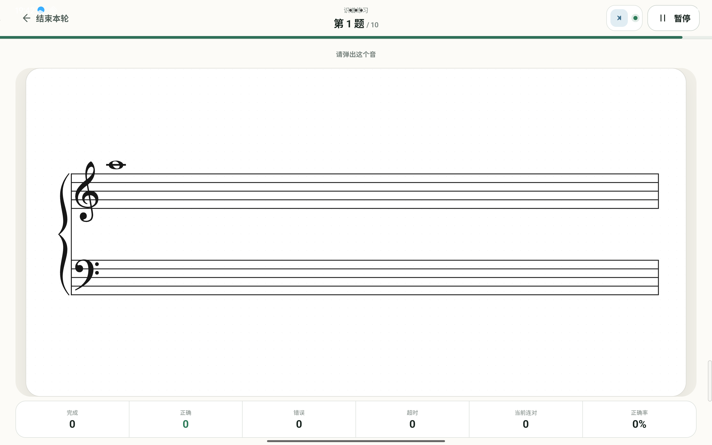
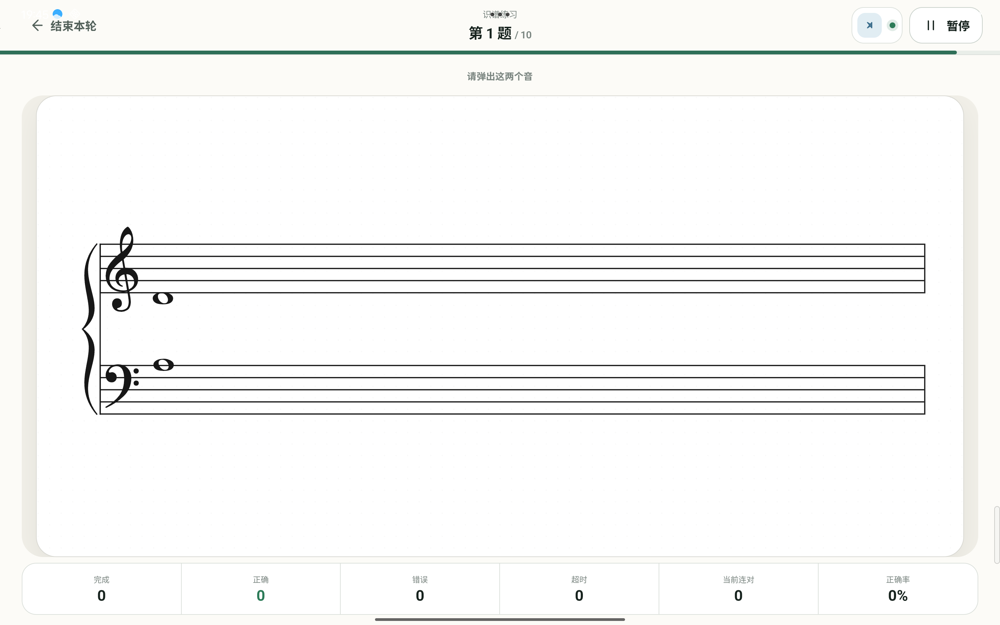
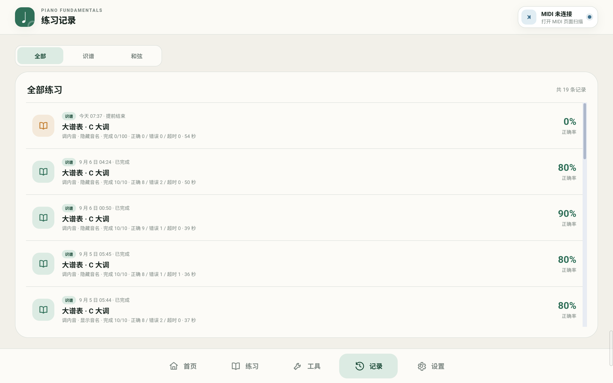

# 钢琴基本功训练器

Piano Fundamentals Trainer 是一款面向横屏 Android 平板的钢琴识谱训练应用。它通过 Android 原生 Bluetooth MIDI 接收真实数码钢琴输入，并以五线谱、即时判定和本地练习记录帮助用户进行专注的识谱训练。

当前公开源码对应 Android `1.4.0`（`versionCode 9`）。Android 是当前支持的产品目标；仓库仅保留 Android 运行、构建、测试及必要共享核心所需的代码。

## 下载

官方 Android Release、APK 与当前更新清单统一由本仓库的 GitHub Releases 提供：

- [下载最新正式版本](https://github.com/Natural516/piano-fundamentals-trainer/releases/latest)

原 [Natural516/piano-trainer-releases](https://github.com/Natural516/piano-trainer-releases) 仓库将作为 Legacy Update Bridge / Historical Release Archive 保留，用于兼容已经发布的旧版 App 更新入口及保存旧版本发布历史。

只有由 Natural516 控制的正式签名身份签署、并通过官方更新验证链校验的 APK 才属于官方构建。

## 当前功能

- 单音识谱与双音识谱
- 高音谱表、低音谱表和大谱表
- 15 个大调调号及调内/半音音高池
- 双音音程训练和答题后音程反馈
- Android 原生 Bluetooth MIDI 输入
- 正确、错误与超时反馈，以及暂停和安全提前结束
- 本地持久化设置、已完成报告和停止后的部分报告
- 基于真实本地报告的只读练习历史
- 用户主动触发、包含包名/版本/哈希/签名验证的安全更新流程
- 除检查和下载更新外，日常练习可离线进行

双音模式要求在答题窗口内弹出目标音高集合，不依赖输入顺序。当前产品使用经过测试的常见音程集合，并在判定完成后显示目标音程；实现细节和确定性契约由共享 Sight Reading 核心及测试保护。

## MIDI 与实机验证

真实设备 Human QA 包括：

- Roland FP-30X 数码钢琴
- Lenovo Xiaoxin Pad Pro 12.7 横屏平板

这些是已验证设备，不表示它们是唯一可能兼容的设备。其他 Android 设备、MIDI 乐器、手机、竖屏或多窗口形态尚未得到同等范围的兼容性承诺。

## 当前范围

Android `1.4.0` 当前完成并发布的训练模块是 Sight Reading。以下模块不是当前 Android 发布功能：

- Scale Practice
- Rhythm
- Chord
- Coordination
- Free Practice
- Score Practice

Android 版本不包含内置钢琴采样发声，也不提供自动/静默安装、后台练习或停止后恢复同一会话。

## 技术架构

- Capacitor Android 原生外壳
- React + TypeScript 平板界面
- VexFlow + Bravura 五线谱渲染
- Kotlin Android Bluetooth MIDI 插件
- 平台无关的 Sight Reading 控制器和确定性时钟/调度边界
- Capacitor Preferences 本地持久化
- 原生 HTTPS 下载、严格 TypeScript 清单解析和 Android 系统安装器交接

`src/renderer` 下保留的少量文件属于 Android 实际依赖的共享旧位置，并不代表当前支持 Electron/Windows 发行。

## 开发与测试

参见 [Android 构建说明](docs/BUILDING_ANDROID.md)。公开验证入口为：

```powershell
npm.cmd ci
npm.cmd run test:public
npm.cmd run android:apk:debug
npm.cmd run test:android-shell
npm.cmd run android:verify:debug
```

公开仓库不包含官方永久签名私钥。普通贡献者应构建 Debug APK；官方 Release 签名仅由维护者在私有环境中完成。

## Fork 与官方构建

分发修改版之前，请阅读：

- [Fork 与官方构建边界](docs/FORKS_AND_OFFICIAL_BUILDS.md)
- [项目品牌与图稿边界](docs/BRANDING.md)

修改版不得沿用官方身份并让用户误认为得到 Natural516 背书；它还必须关闭更新器或完整替换自己的更新基础设施。

## 截图

以下画面来自真实 Android 平板上的正式应用界面。系统状态栏仅包含常规时间、电量与导航信息。

### 首页



### 识谱练习







### 练习记录



## 许可证

项目创建的源代码采用 [Apache License 2.0](LICENSE)。第三方代码、字体及其他材料保留各自许可证，详见 [THIRD_PARTY_NOTICES.md](THIRD_PARTY_NOTICES.md)。官方品牌和图稿不包含在 Apache-2.0 授权中，除非另有明确书面说明。
