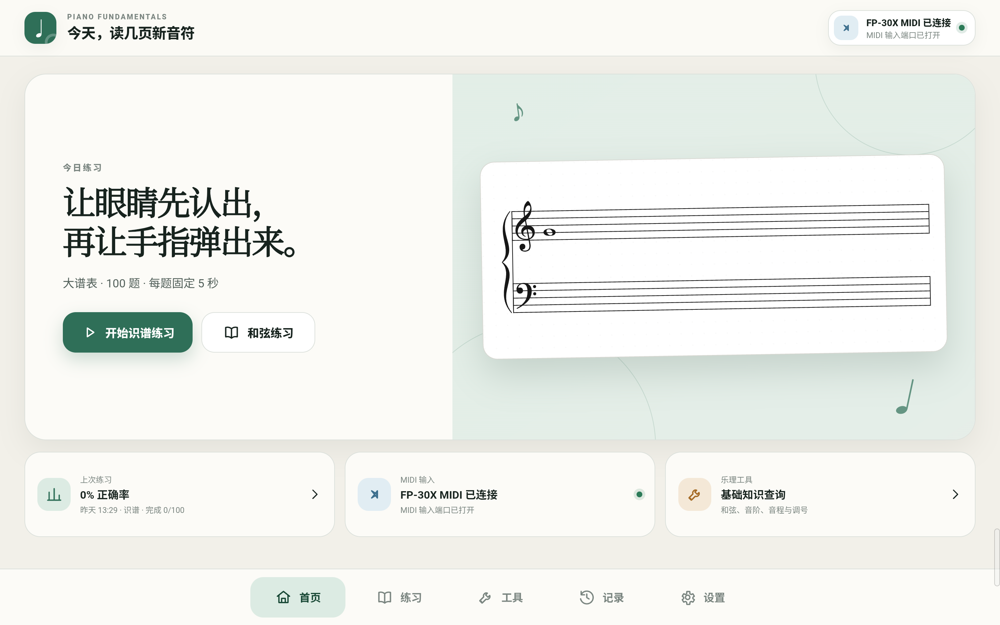
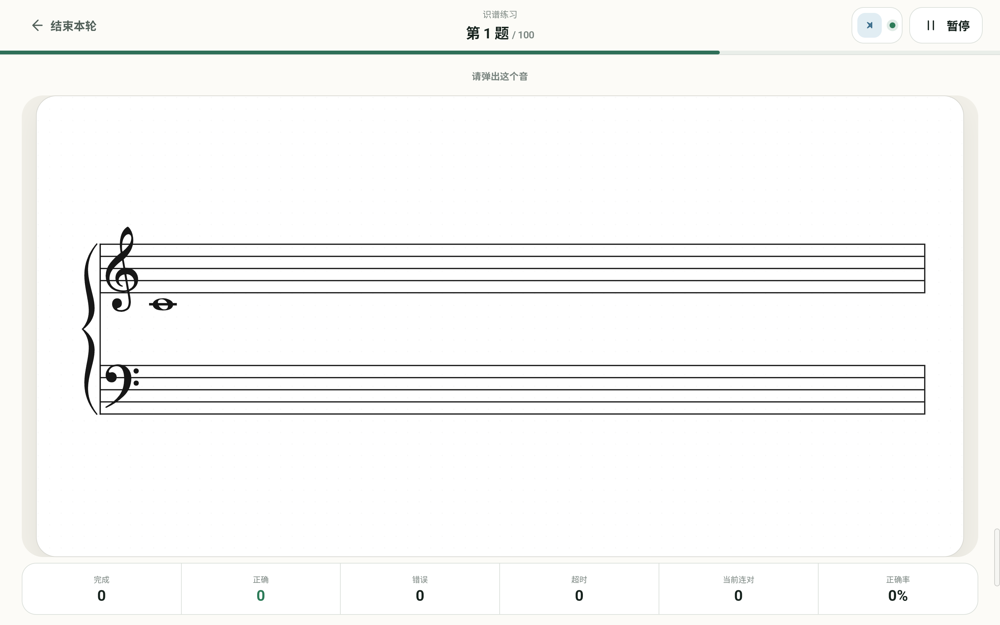
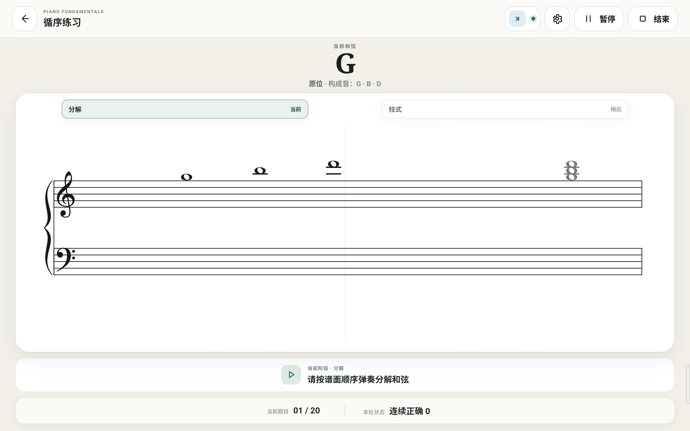
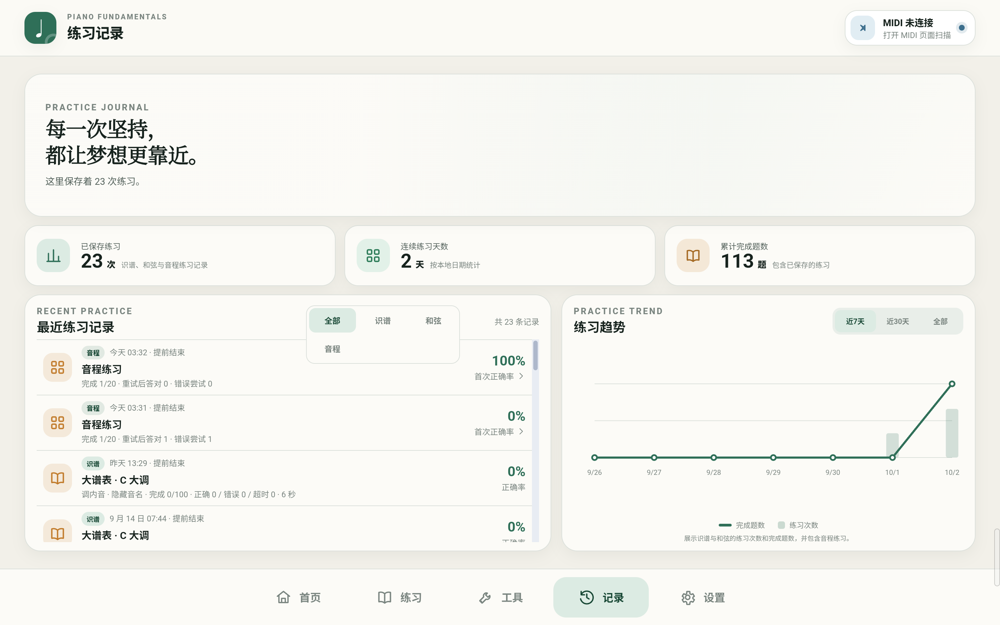

# Piano Fundamentals Trainer

**Piano fundamentals training with real MIDI feedback.**

连接真实 MIDI 钢琴的基本功专项训练器。  
A focused Android tablet trainer for sight reading, chords, intervals, and practice history using real MIDI input.

**Android Tablet · Real MIDI Input · Practice History · Local Data**

[中文](#zh) · [English](#en) · [Latest Release](https://github.com/Natural516/piano-fundamentals-trainer/releases/latest) · [Changelog](CHANGELOG.md) · [Themes](https://github.com/Natural516/piano-fundamentals-trainer-themes)

> Latest stable release: **Android 1.6.0**.  
> Release artifacts are the source of truth for what is currently installable; repository documentation and development work may move ahead of the latest packaged release.

---

## 中文

### 项目简介

Piano Fundamentals Trainer（钢琴基本功训练器）是一款面向横屏 Android 平板的钢琴训练应用。

它不是虚拟钢琴、曲库跟弹软件或完整钢琴课程，而是把 **五线谱 / 乐理题目 / 真实键盘位置** 连接起来：你在平板上看题，然后用真实 MIDI 电钢琴或键盘作答。

当前核心训练包括：

- **识谱练习**：看到五线谱后，在真实键盘上弹出对应音符。
- **和弦练习**：练习三和弦、七和弦、转位与键盘定位。
- **音程练习**：按指定低音构造音程，建立“音程名称 ↔ 五线谱位置 ↔ 实际键盘距离”的联系。
- **乐理工具**：查询和弦、自然大调音阶、调号与音程。
- **练习历史**：回顾已保存的练习结果与完成情况。

### 核心训练

#### 识谱练习

看到谱面后直接用 MIDI 键盘作答，训练谱面音符与键盘位置之间的快速联系。

可根据练习需要选择谱表、调号与题数，并支持单音 / 双音等现有练习流程。

#### 和弦练习

练习三和弦、七和弦、转位与键盘定位。

现有主要模式：

- **循序练习（Progressive practice）**
- **综合随机（Mixed practice）**

练习中会结合柱式和弦、分解和弦、转位和五线谱展示，但不会把 MIDI 输入包装成手型、触键质量或音乐表现力评价。

#### 音程练习

按照指定低音构造音程，例如：

> 请按出以 C4 为低音的纯五度音程。

当前第一版覆盖八度内 **26 种音程**，支持固定题数与无限练习。五线谱始终显示低音；开启答案提示后也会显示目标音。

### 实际画面

以下截图来自 Android 1.6.0 在 Lenovo 平板上的真实应用画面，使用内置浅色主题。

#### 首页

#### 识谱练习

#### 和弦练习

#### 练习历史

### 为什么使用它

- **使用真实钢琴。** 通过 MIDI 电钢琴或键盘作答，而不是用屏幕虚拟键盘代替实际练习。
- **即时 MIDI 反馈。** 根据收到的演奏输入判断当前题目是否完成。
- **专注基本功。** 核心目标是识谱、和弦、音程与基础乐理，而不是做成曲库或游戏。
- **记录留在本地。** 练习历史与主要设置保存在设备上，基本使用不依赖账号；下载与检查更新需要网络。
- **可选主题。** 支持内置浅色 / 深色外观以及签名验证的外部 `.pftheme` 主题包。

MIDI 判定不等于完整演奏评价：应用不声称能够判断手型、身体动作、音色、触键质量或音乐表现力。

### MIDI 与设备

当前正式版本主要通过兼容的 **Bluetooth MIDI** 设备进行真实输入。

已实测：

- Lenovo TB375FC
- Roland FP-30X

这只是实际验证样本，不是兼容设备白名单。其它 Android 平板和 MIDI 键盘仍需要根据系统、硬件与 MIDI 支持情况实际确认。

> 能连接蓝牙音频，不代表设备能够传输 Bluetooth MIDI。

当系统提供真实设备名、端口名等信息时，应用保留这些运行时名称，不把它们翻译成固定产品文案。

### 下载与安装

当前稳定版本：**Android 1.6.0**，主要面向横屏 Android 平板。

**[前往 Latest Release 下载 APK](https://github.com/Natural516/piano-fundamentals-trainer/releases/latest)**

- 在 Release 的 Assets 中下载正式 `.apk`，按 Android 系统提示安装。
- 正式应用提供用户主动触发的“检查更新”流程；下载后仍由 Android 系统确认安装。
- 兼容的正式旧版本可以覆盖安装并保留兼容的历史记录与主要设置。
- 已在 Lenovo TB375FC 上验证从 1.5.3 升级到 1.6.0 的数据保留。
- 不要为了升级先卸载应用或清除数据；其它设备的兼容性与数据保留应以实际情况为准。

### 个性化主题

支持导入 `.pftheme` 个性化主题，也可以随时使用内置浅色或深色主题。

**[浏览官方主题仓库](https://github.com/Natural516/piano-fundamentals-trainer-themes)**

Bocchi（孤独摇滚）1.1.0 提供识谱、和弦和音程练习的主题视觉。主题包版本与 App 版本独立，并由应用检查签名、内容与兼容范围。

外部主题负责视觉素材与安全主题参数，不接管题目、判定、练习统计或持久化业务状态。

### 练习历史与本地数据

练习结果可以写入 History，用于回顾完成题数、正确 / 错误情况和各练习模块已有的统计信息。

数据以设备本地存储为主；当前 README 不承诺云同步、账号同步或跨设备数据同步。

### 开源、构建与安全

- [Apache License 2.0](LICENSE)
- [Building：本地验证与 Debug APK 构建](BUILDING.md)
- [Development：工程入口与主题架构](DEVELOPMENT.md)
- [Security：更新验证与签名安全](SECURITY.md)
- [Third-party notices](THIRD_PARTY_NOTICES.md)

普通用户建议直接使用 GitHub Releases 中的正式 APK。自行构建的 Debug / QA 产物与正式签名应用不是同一个发布身份，不应拿来覆盖正式安装。

[返回顶部](#piano-fundamentals-trainer) · [English](#en)

---

## English

### Overview

Piano Fundamentals Trainer is a focused piano-practice app designed primarily for landscape Android tablets.

It connects **music notation / theory prompts / physical keyboard positions**: read the prompt on the tablet, then answer on a real MIDI piano or keyboard.

Current core areas include:

- **Sight Reading** — read notation and play the requested notes on a real keyboard.
- **Chord Practice** — practice triads, seventh chords, inversions, and keyboard placement.
- **Interval Practice** — build a requested interval above a specified bass note.
- **Theory Tools** — look up chords, natural major scales, key signatures, and intervals.
- **Practice History** — review saved practice results and completed work.

### Core practice

#### Sight Reading

Read the staff and answer directly from a MIDI keyboard, building a faster connection between written notes and physical key positions.

Existing practice flows include configurable staff, key, question count, and single / double-note work.

#### Chord Practice

Practice triads, seventh chords, inversions, and keyboard placement.

Current primary modes:

- **Progressive practice**
- **Mixed practice**

The app can present block chords, arpeggios, inversions, and notation, but MIDI input is not presented as an assessment of hand shape, touch quality, or musical expression.

#### Interval Practice

Build an interval above a specified bass note, for example:

> Play the Perfect fifth with C4 as the bass note.

The first version covers **26 interval types within the octave**, with fixed-count and unlimited practice. The staff always shows the bass note; when answer hints are enabled, it also shows the target note.

### Screenshots

The screenshots below are from the real Android 1.6.0 app running on a Lenovo tablet with the built-in Light theme.

#### Home

#### Sight Reading

#### Chord Practice

#### Practice History

### Why use it

- **Practice on a real instrument.** Answer with a MIDI piano or keyboard instead of an on-screen virtual keyboard.
- **Immediate MIDI feedback.** Incoming performance data is used to judge whether the current task has been completed.
- **Focused fundamentals.** The app is built around sight reading, chords, intervals, and core theory rather than a song library or piano game.
- **Local-first data.** Practice history and major settings are stored on-device. Basic use does not require an account; downloads and update checks require network access.
- **Theme support.** Use the built-in Light / Dark appearance or signed external `.pftheme` packages.

MIDI judgement is not a complete performance assessment. The app does not claim to evaluate hand posture, body movement, tone, touch quality, or musical expression.

### MIDI and device scope

The current stable release primarily uses compatible **Bluetooth MIDI** devices for real input.

Validated hardware includes:

- Lenovo TB375FC
- Roland FP-30X

These are real validation samples, not a compatibility whitelist. Other Android tablets and MIDI keyboards still depend on the operating system, hardware, and MIDI support available on that device.

> Bluetooth audio support does not imply Bluetooth MIDI support.

When the operating system provides real device or port names, the app preserves those runtime names instead of translating them into fixed product text.

### Download and installation

Latest stable version: **Android 1.6.0**, primarily targeting landscape Android tablets.

**[Download the latest APK from GitHub Releases](https://github.com/Natural516/piano-fundamentals-trainer/releases/latest)**

- Download the production `.apk` from the Release assets and install it through Android's normal installer.
- The production app also provides a user-triggered update check; Android still asks for confirmation before installation.
- Compatible production releases can be installed over older versions while preserving compatible history and major settings.
- Data retention from 1.5.3 to 1.6.0 has been validated on the Lenovo TB375FC.
- Do not uninstall the app or clear its data just to update it; behavior on other devices should be verified in practice.

### Themes

The app supports imported `.pftheme` packages as well as the built-in Light and Dark appearances.

**[Browse the official theme repository](https://github.com/Natural516/piano-fundamentals-trainer-themes)**

Bocchi 1.1.0 provides themed visuals for Sight Reading, Chord Practice, and Interval Practice. Theme-package versions are independent from the app version, and imported packages are checked for signature, content, and compatibility.

External themes provide visual assets and safe theme parameters. They do not control questions, judgement, practice statistics, or persistence.

### Practice history and local data

Saved practice results can be reviewed in History, including completed-question counts, correct / incorrect outcomes, and the statistics already provided by each practice module.

Data is primarily stored on-device. This README does not promise cloud sync, account sync, or cross-device synchronization.

### Open source, building, and security

- [Apache License 2.0](LICENSE)
- [Building — local verification and Debug APK builds](BUILDING.md)
- [Development — project entry points and theme architecture](DEVELOPMENT.md)
- [Security — update verification and signing boundaries](SECURITY.md)
- [Third-party notices](THIRD_PARTY_NOTICES.md)

For normal use, install the production APK from GitHub Releases. Debug / QA builds use a different development identity and should not be treated as production upgrades.

[Back to top](#piano-fundamentals-trainer) · [中文](#zh)
