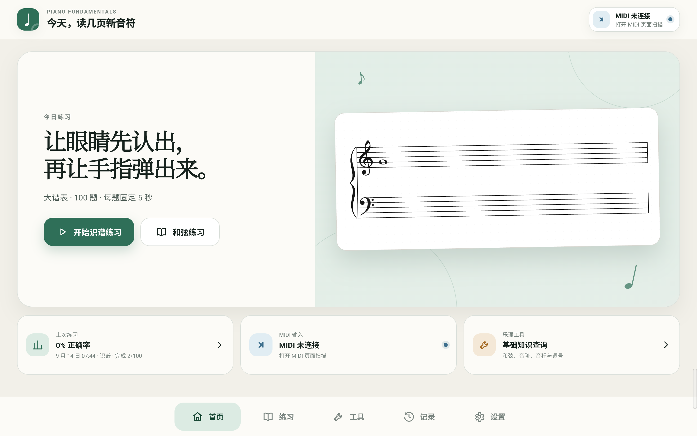
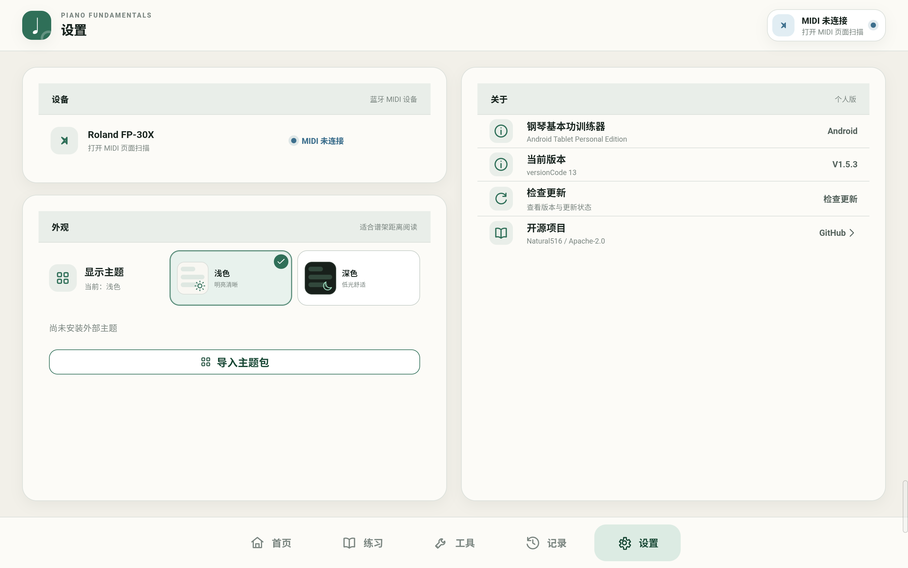

# Piano Fundamentals Trainer

钢琴基本功训练器是一款面向 Android 平板的 MIDI 钢琴练习应用。

当前发布准备版本：Android `1.6.0`（V1.6.0，`versionCode 14`，Unreleased）
当前已发布版本仍为 V1.5.3；V1.6.0 尚未提供正式 APK、tag 或 GitHub Release。
平台：Android Tablet

## 当前功能

### 练习

- 识谱练习
- 和弦练习
- 音程练习：指定低音构造音程，覆盖 26 种音程的理论拼写与候选生成

音程练习始终显示 Grand Staff：答案提示 OFF 时仅显示指定低音，ON 时显示低音与目标音。支持低音升降号设置、固定题数 / 无限练习、MIDI 自动判定，以及 Result / History 和困难音程统计。

### 乐理工具

- 基础知识与和弦查询
- 自然大调音阶与调号
- 音程查询

### MIDI、记录与外观

- MIDI 钢琴输入与设备状态
- 本地练习历史记录
- 浅色、深色主题
- 外部 `.pftheme` 个性化主题
- 主题包签名验证、安装、更新、删除与故障回退

应用的练习、乐理计算、统计和历史记录均由真实 UI 与本地数据驱动，不依赖截图或主题素材提供功能信息。

## 产品截图

以下截图来自已经完成 Release Candidate 验收的 V1.5.3 Production 应用。

### 首页



### 设置与主题管理



## 下载与安装

正式 APK 通过本仓库的 [GitHub Releases](https://github.com/Natural516/piano-fundamentals-trainer/releases) 提供。

已有 V1.5.2（`versionCode 12`）用户可以直接覆盖安装 V1.5.3，无需先卸载。覆盖升级可保留兼容的本地 History 与主要练习设置。

应用内提供由用户主动触发的正式更新检查。下载与安装前会校验包名、版本、文件大小、SHA-256 和正式签名身份。

V1.6.0 当前仅处于源码与发布元数据准备阶段；正式包构建、签名、更新清单和覆盖升级验证仍待下一阶段执行。

## 个性化主题

V1.5.3 起支持外部 `.pftheme` 个性化主题。主题包与应用版本分离，并经过 Theme API、最低应用版本、内容完整性和 Production 签名验证。

个性化主题通过独立仓库提供：

- [piano-fundamentals-trainer-themes](https://github.com/Natural516/piano-fundamentals-trainer-themes)

首个主题包为“孤独摇滚”（主题 ID：`natural516.bocchi`）。

本次准备的 Bocchi SOURCE 为 `1.1.0`，最低宿主版本 `1.6.0`，最高宿主版本不含 `2.0.0`。新增音程 Practice Hub 卡片与 ACTIVE 蓝色手账视觉，Preparation / Result / History Detail 不新增专属视觉。该版本尚未签名打包或正式发布；现有正式主题仍为 `1.0.0`。

## 构建与验证

公开仓库包含 Android 应用运行、构建、测试及必要共享核心所需的源码。常用公开验证入口：

```powershell
npm.cmd ci
npm.cmd run typecheck
npm.cmd run test:android-release-preparation
npm.cmd run test:android-interval-theory
npm.cmd run android:apk:debug
npm.cmd run test:android-shell
npm.cmd run android:verify:debug
```

官方永久签名私钥不进入公开仓库。普通贡献者应构建 Debug APK；正式 Release 由维护者使用独立保管的签名身份生成。

## 项目与许可证

- 公开仓库：[Natural516/piano-fundamentals-trainer](https://github.com/Natural516/piano-fundamentals-trainer)
- 源代码许可证：[Apache License 2.0](LICENSE)
- 第三方材料说明：[THIRD_PARTY_NOTICES.md](THIRD_PARTY_NOTICES.md)

官方品牌、主题图稿与第三方素材不因源代码许可证而自动获得同等授权；具体边界以仓库内对应说明为准。
